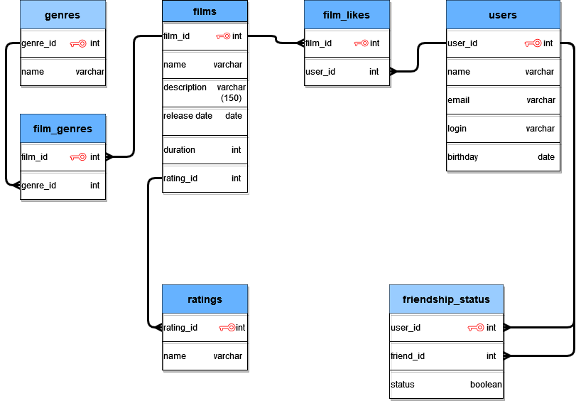

## Проект Фильмография
"Это приложение для поиска лучших сериалов и фильмов **может**:
1. Добавлять пользователей и фильмы.
2. Имеет возможность проставить лайки.
3. Можно добовлять друзей.
4. Тестирует пограничьные  условия.

Приложение написано на языке Java.
```java
public class FilmorateApplication {
    public static void main(String[] args) {
    }
}
```
## Работа с Базой Данных


**Примеры запросов:**

Получить фильм с id 2
```
SELECT *
FROM films
WHERE film_id = 3;
```
Получить список всех пользователей
```
SELECT  u.user_id
        u.name,
        u.login
        u.email
        u.birthday
        COUNT(fs.friend_id) AS friendslist
FROM users AS u
LEFT JOIN friendship_statuses AS fs ON u.user_id = fs.user_id
GROUP BY u.user_id
HAVING fs.status = true;
```